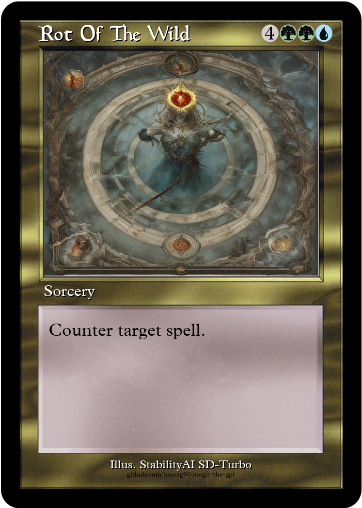
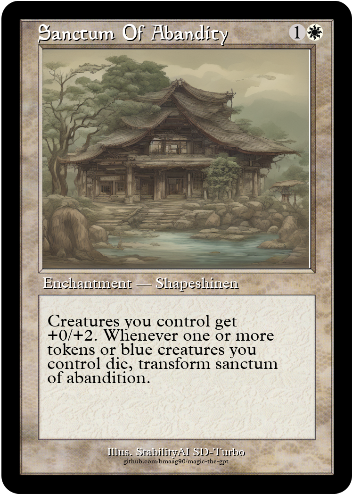
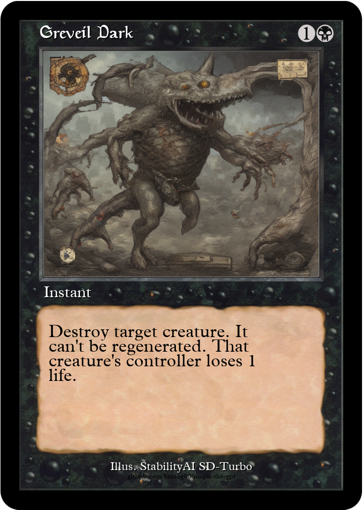
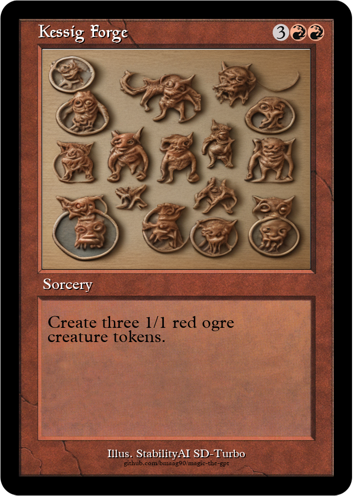
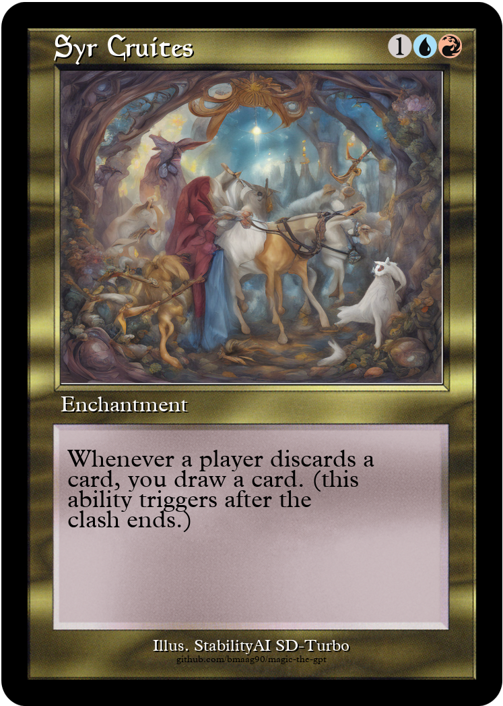

# mtg-sd
Magic The Gathering card creator with illustrations created by Stability AI SD model

# Overview

Simple MTG card creator using the SD-Turbo stable diffusion model by StabilityAI [https://huggingface.co/stabilityai/sd-turbo](https://huggingface.co/stabilityai/sd-turbo).
The card information, i.e. name, mana cost, type, rules text etc. is created using the magic-the-gpt model: [https://github.com/bmaag90/magic-the-gpt](https://github.com/bmaag90/magic-the-gpt)

## Requirements

Requires some specific fonts (Plantin and Beleren), which are not provided in this repo.

# Run

`python mtg_card_creator.py`

Arguments:
1. `--card_text=<string of card information generated my magic-the-gpt>` 
2. `--save_path=<path where cards are store>`
3. `--num_examples=<number of different illustrations to create>` 
4. `--prompt_format=<which card fields to include in the prompt, separated by comma>`, e.g. `card_name,card_type,rules_text` or `card_name,card_type` (has quite an impact on the generated images)

## Examples

`"rot of the wild, {4}{g}{g}{u}, sorcery, counter target spell., power nan, toughness nan"`

`"sanctum of abandity, {1}{w}, enchantment — shapeshinen, creatures you control get +0/+2. whenever one or more tokens or blue creatures you control die, transform sanctum of abandition., power nan, toughness nan"`

`"greveil dark, {1}{b}, instant, destroy target creature. it can't be regenerated. that creature's controller loses 1 life., power nan, toughness nan"`

`"kessig forge, {3}{r}{r}, sorcery, create three 1/1 red ogre creature tokens., power nan, toughness nan"`

`"syr cruites, {1}{u}{r}, enchantment, whenever a player discards a card, you draw a card. (this ability triggers after the clash ends.), power nan, toughness nan"`

